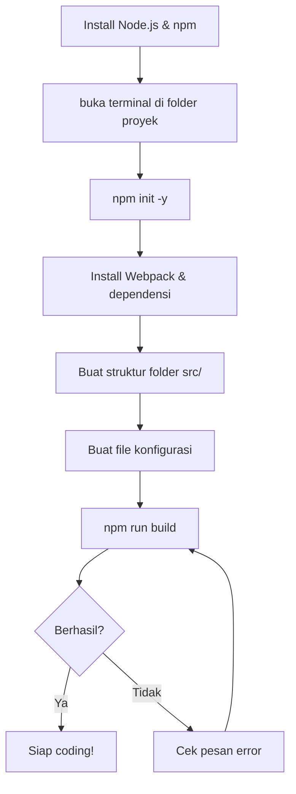

# Modul 01: Persiapan Awal (Setup)

## 🎯 Tujuan Modul
Pada akhir modul ini, Anda akan memiliki lingkungan pengembangan yang siap digunakan. Webpack akan berjalan, file akan ter-bundle, dan Anda bisa melihat hasilnya di browser.

---

## 📋 Diagram Alur Proses Setup



---

## 📦 Langkah 1: Install Node.js & npm

**Apa itu?** Node.js adalah "mesin" yang menjalankan JavaScript di komputer Anda (tidak hanya di browser). npm adalah tempat belanja library JavaScript.

**Cek apakah sudah terinstall:**
```bash
node --version   # Harus muncul angka, misal: v20.x.x
npm --version    # Harus muncul angka, misal: v10.x.x
```

**Jika belum ada:** Download di https://nodejs.org/ (pilih versi LTS).

---

## 📁 Langkah 2: Inisialisasi Proyek

Buka terminal di folder `odin-todo` yang sudah Anda buat.

```bash
npm init -y
```

**Yang terjadi:** File `package.json` akan dibuat. Ini adalah "kartu identitas" proyek Anda. Di sinilah nanti semua library yang Anda install akan tercatat.

---

## ⚙️ Langkah 3: Install Webpack & Dependensi

**Apa itu Webpack?** Webpack adalah "asisten pabrik" yang tugasnya:
1. Menggabungkan semua file `.js` Anda menjadi satu file.
2. Memproses CSS dan menginjeksikannya ke halaman.
3. Menangani file gambar/aset.
4. Menyediakan server pengembangan dengan *live reload* (halaman refresh otomatis saat Anda edit kode).

```bash
# Install Webpack (alat bundle)
npm install --save-dev webpack webpack-cli webpack-dev-server

# Install Loader CSS (agar Webpack bisa baca file .css)
npm install --save-dev css-loader style-loader

# Install Plugin HTML (agar Webpack otomatis inject script ke HTML)
npm install --save-dev html-webpack-plugin

# Install html-loader (agar Webpack bisa baca aset di file HTML)
npm install --save-dev html-loader

# Install date-fns (untuk format tanggal nanti)
npm install date-fns
```

**Apa beda `--save-dev` dan tanpa flag?**
- `--save-dev` (devDependencies): Library yang hanya dipakai saat *development* (webpack, loader).
- Tanpa flag (dependencies): Library yang dipakai di *production* (date-fns).

---

## 🗂️ Langkah 4: Buat Struktur Folder

Webpack membutuhkan struktur folder yang rapi. Folder `src/` adalah tempat Anda bekerja. Folder `dist/` adalah hasil jadi (otomatis dibuat oleh Webpack).

```text
odin-todo/
├── dist/                  <-- Hasil build (otomatis)
├── src/                   <-- TEMPAT KERJA ANDA
│   ├── assets/
│   │   ├── style.css      <-- File CSS Anda
│   │   └── img/           <-- Folder gambar
│   │       └── odin-logo.png
│   ├── dom/               <-- Modul tampilan (nanti)
│   │   └── ui.js
│   ├── logic/             <-- Modul logika (nanti)
│   │   ├── todo.js
│   │   ├── project.js
│   │   ├── app.js
│   │   └── storage.js
│   └── index.js           <-- ENTRY POINT (file utama)
├── index.html             <-- Template HTML
├── package.json           <-- Daftar library
└── webpack.config.cjs     <-- Konfigurasi Webpack
```

**Buat foldernya di terminal:**
```bash
mkdir -p src\assets\img src\dom src\logic
```

---

## 📝 Langkah 5: Buat File Konfigurasi Webpack

**Apa yang dilakukan file ini?** Ini adalah "resep" yang memberi tahu Webpack:
- Di mana file utama Anda (`entry`)
- Ke mana hasilnya akan disimpan (`output`)
- Bagaimana cara memproses CSS dan gambar (`module.rules`)
- Template HTML apa yang dipakai (`plugins`)

Buat file `webpack.config.cjs` di root folder (`odin-todo/`):

```javascript
// webpack.config.cjs
const path = require("path");
const HtmlWebpackPlugin = require("html-webpack-plugin");

module.exports = {
  mode: "development",
  entry: "./src/index.js",
  output: {
    filename: "main.js",
    path: path.resolve(__dirname, "dist"),
    clean: true,
  },
  module: {
    rules: [
      {
        test: /\.css$/i,
        use: ["style-loader", "css-loader"],
      },
      {
        test: /\.(png|svg|jpg|jpeg|gif)$/i,
        type: "asset/resource",
      },
      {
        test: /\.html$/i,
        loader: "html-loader",
      },
    ],
  },
  plugins: [
    new HtmlWebpackPlugin({
      template: "./index.html",
    }),
  ],
};
```

**Penjelasan bagian per bagian:**

| Bagian | Fungsi |
|--------|--------|
| `entry: "./src/index.js"` | File pertama yang akan dibaca Webpack. Dari sini Webpack akan "merambat" ke file-file lain yang di-import. |
| `output.filename: "main.js"` | Hasil gabungan semua file JS akan menjadi satu file bernama `main.js`. |
| `module.rules[0]` | Aturan untuk file `.css`: baca dengan `css-loader`, lalu sematkan ke halaman dengan `style-loader`. |
| `module.rules[1]` | Aturan untuk file gambar: salin ke folder `dist` dan beri nama hash. |
| `module.rules[2]` | Aturan untuk file HTML: proses dengan `html-loader` agar aset di HTML terdeteksi. |
| `HtmlWebpackPlugin` | Ambil `index.html` sebagai template, lalu tambahkan tag `<script>` otomatis ke dalamnya. |

**Mengapa ekstensi `.cjs`?** Karena kita menggunakan `require` (sintaks CommonJS), bukan `import`. Ekstensi `.cjs` memberi tahu Node.js untuk memperlakukan file ini sebagai CommonJS.

---

## 📄 Langkah 6: Buat Template HTML

File ini adalah "kerangka" halaman web Anda. Webpack akan mengambil file ini, memprosesnya, dan menyalinnya ke folder `dist/`.

Buat/update file `index.html` di root folder:

```html
<!-- index.html -->
<!doctype html>
<html lang="en">
  <head>
    <meta charset="UTF-8" />
    <meta name="viewport" content="width=device-width, initial-scale=1.0" />
    <title>Odin Todo List</title>
  </head>
  <body>
    <div id="app"></div>
  </body>
</html>
```

**Penting:** Tag `<script>` atau `<link>` tidak perlu ditulis manual. Webpack akan menambahkannya secara otomatis saat build.

---

## 📜 Langkah 7: Atur Script di `package.json`

Buka `package.json`, cari bagian `"scripts"`, dan ubah menjadi:

```json
"scripts": {
  "build": "webpack",
  "start": "webpack serve --open",
  "deploy": "gh-pages -d dist"
}
```

**Fungsi masing-masing script:**
| Perintah | Fungsi |
|----------|--------|
| `npm run build` | Membangun (build) proyek → hasil di folder `dist/` |
| `npm run start` | Menjalankan server pengembangan → otomatis buka browser |
| `npm run deploy` | (Opsional) upload ke GitHub Pages |

---

## ✅ Langkah 8: Buat File Entry Point (Minimal)

Buat file `src/index.js` dan isi dengan kode minimal:

```javascript
// src/index.js
console.log("Hello, Todo App!");
```

Ini hanya untuk memastikan Webpack berfungsi.

---

## 🚀 Langkah 9: Jalankan!

```bash
npm run start
```

**Yang akan terjadi:**
1. Webpack akan membangun proyek Anda.
2. Browser akan terbuka (otomatis) menampilkan halaman kosong.
3. Buka DevTools (F12) → tab Console. Anda akan melihat tulisan "Hello, Todo App!".

**Jika muncul error:**
- `Module parse failed` seperti sebelumnya → Pastikan `"type": "module"` dihapus dari `package.json`, dan konfigurasi Webpack menggunakan ekstensi `.cjs`.
- `Cannot find module '...'` → Jalankan `npm install` untuk menginstall ulang semua dependensi.

---

## 🎉 Selamat!

Lingkungan pengembangan Anda sudah siap. Sekarang Anda tinggal fokus menulis kode di folder `src/`, dan Webpack akan mengurus sisanya.

**Lanjut ke Modul 02:** Membangun Fondasi Data (Todo & Project)

---

## 📖 Ringkasan Istilah Penting

| Istilah | Arti |
|---------|------|
| **Entry Point** | File JS pertama yang dibaca Webpack. |
| **Bundle** | Hasil gabungan semua file JS menjadi satu file. |
| **Loader** | "Penerjemah" untuk file non-JS (CSS, gambar). |
| **Plugin** | Fitur tambahan (misal: auto-inject script ke HTML). |
| **Live Reload** | Browser refresh otomatis saat Anda mengubah kode. |
| **Dev Server** | Server lokal untuk pengembangan. |
