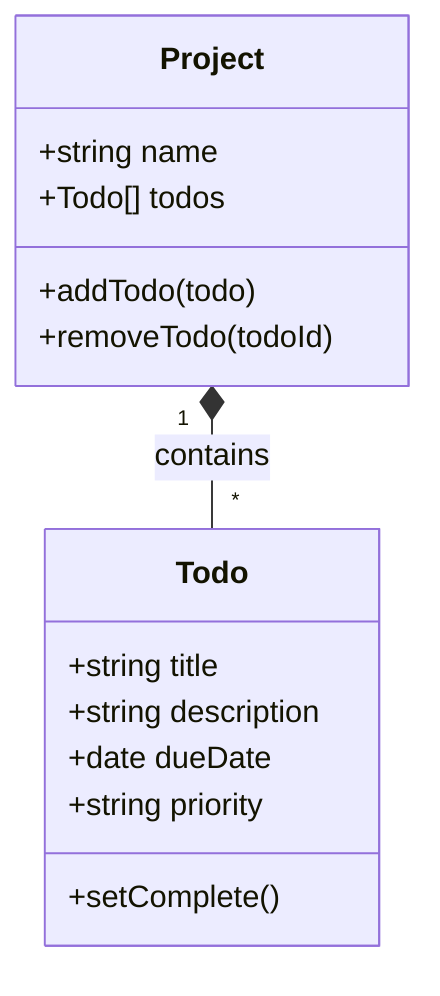

# 02 - Data Model

Gunakan *Class* untuk struktur data agar mendukung metode instans.

## Diagram Hubungan


## Struktur Implementasi
### Todo Class
```javascript
class Todo {
  constructor(title, description, dueDate, priority) {
    this.title = title;
    this.description = description;
    this.dueDate = dueDate;
    this.priority = priority;
    this.isDone = false;
  }
  toggleDone() { this.isDone = !this.isDone; }
}
```
