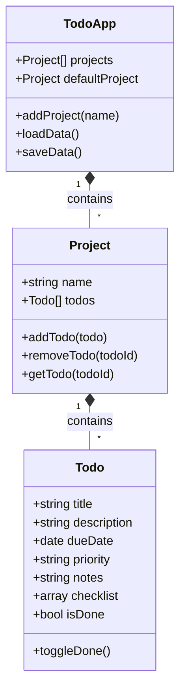

# 02 - Data Model

Gunakan *Class* untuk struktur data agar mendukung metode instans.

## Diagram Hubungan


## Struktur Implementasi
### Todo Class (Low Level)
```javascript
// src/logic/Todo.js
export class Todo {
  constructor(title, description, dueDate, priority, notes = "", checklist = []) {
    this.title = title;
    this.description = description;
    this.dueDate = dueDate; // Gunakan date-fns untuk manipulasi
    this.priority = priority; // 'Low', 'Medium', 'High'
    this.notes = notes;
    this.checklist = checklist;
    this.isDone = false;
  }
  toggleDone() { this.isDone = !this.isDone; }
}
```

### Project Class
```javascript
// src/logic/Project.js
export class Project {
  constructor(name) {
    this.name = name;
    this.todos = [];
  }
  addTodo(todo) { this.todos.push(todo); }
  removeTodo(todoTitle) {
    this.todos = this.todos.filter(todo => todo.title !== todoTitle);
  }
}
```

## Persyaratan Khusus
1. **Default Project:** Saat `TodoApp` diinisialisasi, buat satu instans `Project` dengan nama 'Default'.
2. **Dynamic Objects:** Seluruh data harus bisa di-instansiasi ulang dari data JSON yang disimpan.
