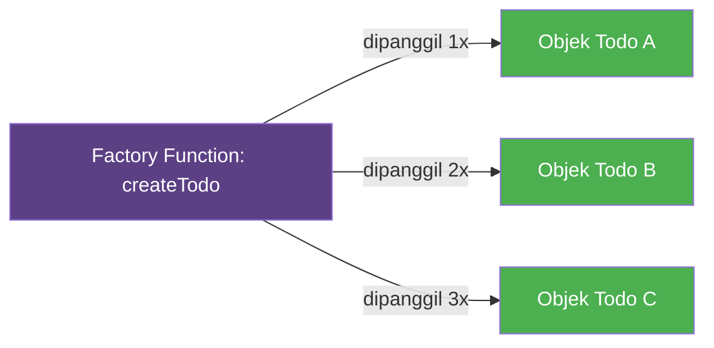
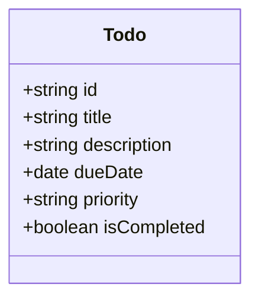
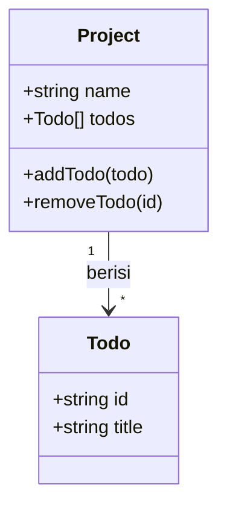

# Modul 02: Membangun Fondasi Data (Data Model)

## 🎯 Tujuan Modul
Membuat "cetakan" (factory) untuk dua jenis objek utama aplikasi:
1. **Todo** → Unit pekerjaan (tugas individual)
2. **Project** → Wadah untuk mengelompokkan Todo

Pada akhir modul ini, Anda bisa membuat Todo dan Project hanya dengan memanggil fungsi.

---

## 🧠 Konsep Penting: Factory Function

### Apa itu Factory Function?
Bayangkan Anda membuat kue. Anda tidak membuat kue dari nol setiap kali — Anda punya **cetakan kue**. Anda tinggal tuang adonan ke cetakan, dan jadilah kue dengan bentuk yang sama.

**Factory Function** adalah "cetakan" untuk objek JavaScript.



Setiap kali Anda panggil `createTodo(...)`, Anda mendapat objek baru yang strukturnya sama.

### Kenapa Factory Function, bukan Class?

| Aspek | Class | Factory Function |
|-------|-------|------------------|
| Struktur hasil | Instance Class (punya prototype) | Objek literal `{...}` |
| Simpan ke JSON | Bisa, tapi method hilang | Bisa, dan lebih aman |
| Method | Ada di prototype | Langsung di objek |
| Kompleksitas | Perlu `constructor`, `this`, `new` | Tinggal return objek |

**Untuk proyek ini, Factory Function lebih cocok** karena data akan sering diubah ke JSON (untuk localStorage) dan sebaliknya.

---

## 📦 Langkah 1: Membuat Todo Factory

### Diagram Struktur Todo



Seperti yang Anda lihat, sebuah Todo hanya memiliki **data** — tidak ada method/fungsi di dalamnya. Semua pengelolaan akan dilakukan oleh modul lain.

### Instruksi

1. Buka folder `src/logic/`.
2. Buat file baru bernama `todo.js`.
3. Salin kode berikut:

```javascript
// src/logic/todo.js

/**
 * Factory Function: Membuat objek Todo baru.
 * @param {string} title - Judul tugas
 * @param {string} description - Deskripsi tugas
 * @param {string} dueDate - Tanggal deadline (format: YYYY-MM-DD)
 * @param {string} priority - Prioritas: "low", "medium", "high"
 * @returns {object} Objek Todo
 */
export const createTodo = (title, description, dueDate, priority) => {
  return {
    id: Date.now().toString(),
    title,
    description,
    dueDate,
    priority,
    isCompleted: false,
  };
};
```

### Penjelasan Detail

Baris per baris:

| Kode | Penjelasan |
|------|------------|
| `export const createTodo = (...) => {` | Membuat fungsi bernama `createTodo` dan mengekspornya agar bisa dipakai di file lain. |
| `id: Date.now().toString()` | Membuat ID unik berdasarkan waktu saat ini (dalam milidetik). Karena setiap Todo dibuat di waktu berbeda, ID-nya pasti unik. |
| `title,` | Ini adalah *shorthand property*. Sama dengan `title: title`. |
| `description, dueDate, priority,` | Parameter yang langsung dijadikan properti objek. |
| `isCompleted: false` | Status default: belum selesai. |

### Cara Menggunakan (Coba nanti di `index.js`):

```javascript
import { createTodo } from './logic/todo.js';

const tugas1 = createTodo(
  "Belajar Webpack",
  "Mempelajari cara konfigurasi Webpack",
  "2026-07-10",
  "high"
);

console.log(tugas1);
// Output:
// {
//   id: "1746547890123",
//   title: "Belajar Webpack",
//   description: "Mempelajari cara konfigurasi Webpack",
//   dueDate: "2026-07-10",
//   priority: "high",
//   isCompleted: false
// }
```

---

## 📁 Langkah 2: Membuat Project Factory

### Diagram Struktur Project



Sebuah Project berisi:
- **Data:** `name` (nama proyek), `todos` (array kosong untuk menampung Todo)
- **Method:** `addTodo()` (menambah Todo), `removeTodo()` (menghapus Todo berdasarkan ID)

### Instruksi

1. Di folder `src/logic/`, buat file baru bernama `project.js`.
2. Salin kode berikut:

```javascript
// src/logic/project.js

/**
 * Factory Function: Membuat objek Project baru.
 * Project adalah wadah untuk mengelompokkan Todo.
 * @param {string} name - Nama proyek (contoh: "Pekerjaan", "Belajar")
 * @returns {object} Objek Project dengan method addTodo dan removeTodo
 */
export const createProject = (name) => {
  return {
    name,
    todos: [],

    /**
     * Menambahkan Todo ke dalam proyek ini.
     * @param {object} todo - Objek Todo (hasil dari createTodo)
     */
    addTodo(todo) {
      this.todos.push(todo);
    },

    /**
     * Menghapus Todo berdasarkan ID.
     * @param {string} id - ID unik Todo yang ingin dihapus
     */
    removeTodo(id) {
      this.todos = this.todos.filter(t => t.id !== id);
    },
  };
};
```

### Penjelasan Detail

**Bagian `name` dan `todos`:**
```javascript
name,
todos: [],
```
Properti biasa. `name` menyimpan string, `todos` menyimpan array yang akan diisi dengan objek Todo.

**Method `addTodo`:**
```javascript
addTodo(todo) {
  this.todos.push(todo);
}
```
- `this.todos` mengacu pada array `todos` milik project ini.
- `.push(todo)` menambahkan Todo ke akhir array.
- Setiap kali dipanggil, array akan bertambah satu Todo.

**Method `removeTodo`:**
```javascript
removeTodo(id) {
  this.todos = this.todos.filter(t => t.id !== id);
}
```
- `this.todos.filter(...)` membuat array baru yang berisi semua Todo **kecuali** yang ID-nya cocok dengan parameter `id`.
- Array lama diganti dengan array baru (tanpa Todo yang dihapus).

**Apa itu `filter`?** Bayangkan Anda punya keranjang berisi 5 bola. `filter` adalah: "Ambil semua bola kecuali bola yang bernomor 3." Hasilnya: keranjang baru berisi 4 bola.

### Cara Menggunakan (Coba nanti):

```javascript
import { createTodo } from './logic/todo.js';
import { createProject } from './logic/project.js';

const project = createProject("Belajar");

const todo1 = createTodo("Webpack", "Belajar konfigurasi", "2026-07-10", "high");
const todo2 = createTodo("CSS Grid", "Praktek layout", "2026-07-12", "medium");

project.addTodo(todo1);
project.addTodo(todo2);

console.log(project.todos);
// Output: Array berisi 2 objek Todo

project.removeTodo(todo1.id);
console.log(project.todos);
// Output: Array berisi 1 objek Todo (todo2 saja)
```

---

## 🔗 Diagram Hubungan Antara File

```mermaid
graph TD
    subgraph "src/logic/"
        A[todo.js] -->|createTodo| C[Objek Todo]
        B[project.js] -->|createProject| D[Objek Project]
        D -->|.todos[]| C
        D -->|.addTodo()| C
        D -->|.removeTodo()| C
    end
    
    subgraph "src/"
        E[index.js] -->|import| A
        E -->|import| B
        E -->|menggabungkan| D
    end
    
    style A fill:#FF9800,color:white
    style B fill:#FF9800,color:white
    style E fill:#5c4084,color:white
```

---

## ✅ Tugas Anda

1. Buat file `src/logic/todo.js` → implementasi `createTodo`
2. Buat file `src/logic/project.js` → implementasi `createProject`

**Cek pemahaman:** Setelah selesai, jawab dalam hati:
- Apa yang terjadi jika `createTodo` dipanggil tanpa parameter `title`? (Jawab: properti `title` akan bernilai `undefined`)
- Kenapa `id` menggunakan `Date.now().toString()`? (Jawab: untuk memastikan setiap Todo punya ID unik)

**Lanjut ke Modul 03** setelah kedua file selesai dibuat.
