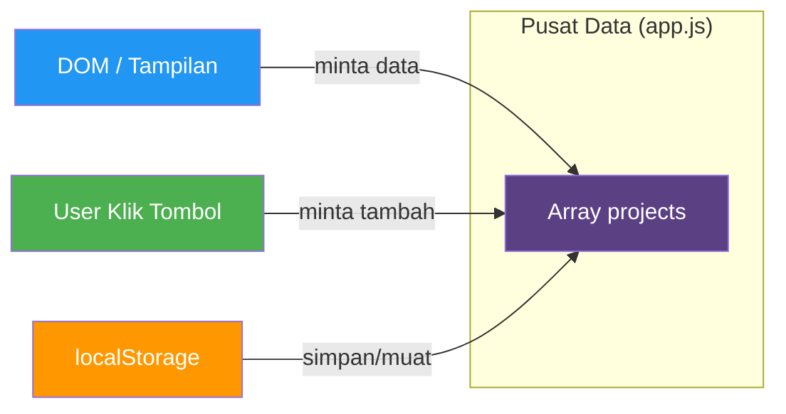
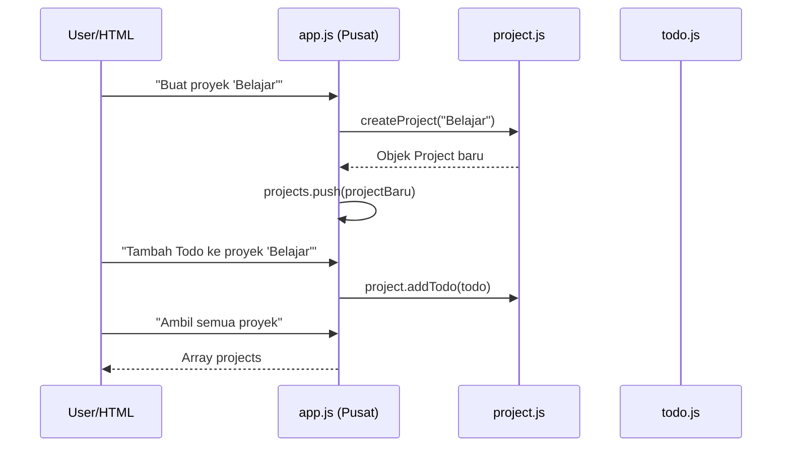

# Modul 03: Otak Aplikasi (Logic Controller)

## 🎯 Tujuan Modul
Membuat pusat kendali yang mengelola **semua** data aplikasi. Modul ini bertugas:
- Menyimpan daftar semua Project
- Menambah/menghapus Project
- Menyediakan data untuk ditampilkan oleh modul DOM

**Aturan PENTING:** Modul ini tidak boleh menyentuh DOM sama sekali! Tidak ada `document`, `window`, atau `innerHTML`.

---

## 🧠 Konsep: Single Source of Truth



**Apa itu Single Source of Truth (SSOT)?**

Bayangkan Anda punya 3 catatan tentang nomor telepon teman Anda:
- Catatan di HP: 0812-3456
- Catatan di sticky note: 0812-7890
- Catatan di buku: 0812-3456

👉 Mana yang benar? **Bingung, kan?**

**SSOT** berarti hanya ada SATU tempat penyimpanan data, dan semua bagian lain (tampilan, penyimpanan) harus merujuk ke tempat itu. Di aplikasi kita, array `projects` di `app.js` adalah SSOT-nya.

---

## 📁 Langkah: Membuat App Controller

### Diagram Alur Data



### Instruksi

1. Di folder `src/logic/`, buat file baru bernama `app.js`.
2. Salin kode berikut:

```javascript
// src/logic/app.js
import { createProject } from './project.js';

/**
 * ========================================
 *  PUSAT DATA APLIKASI (Single Source of Truth)
 * ========================================
 * Semua data disimpan di sini. Modul lain (seperti DOM)
 * hanya boleh membaca dan memodifikasi melalui fungsi-fungsi
 * yang diekspor dari file ini.
 * ========================================
 */

// --- STATE (Data) ---

/** Array yang menyimpan semua proyek */
let projects = [];

// Inisialisasi: buat proyek "Default" saat aplikasi pertama dijalankan
projects.push(createProject("Default"));


// --- FUNGSI-FUNGSI ---

/**
 * Menambahkan proyek baru ke dalam daftar.
 * @param {string} name - Nama proyek baru
 */
export const addProject = (name) => {
  const newProject = createProject(name);
  projects.push(newProject);
};

/**
 * Mengembalikan semua proyek yang ada.
 * @returns {Array} Array berisi objek-objek Project
 */
export const getProjects = () => {
  return projects;
};

/**
 * Mencari proyek berdasarkan nama.
 * @param {string} name - Nama proyek yang dicari
 * @returns {object|undefined} Objek Project jika ditemukan, undefined jika tidak
 */
export const getProjectByName = (name) => {
  return projects.find(project => project.name === name);
};

/**
 * Menghapus proyek berdasarkan nama.
 * @param {string} name - Nama proyek yang akan dihapus
 */
export const removeProject = (name) => {
  projects = projects.filter(project => project.name !== name);
};

/**
 * Menambahkan Todo ke dalam proyek tertentu.
 * @param {string} projectName - Nama proyek tujuan
 * @param {object} todo - Objek Todo (hasil dari createTodo)
 */
export const addTodoToProject = (projectName, todo) => {
  const project = getProjectByName(projectName);
  if (project) project.addTodo(todo);
};

/**
 * Menghapus Todo dari proyek tertentu.
 * @param {string} projectName - Nama proyek
 * @param {string} todoId - ID Todo yang akan dihapus
 */
export const removeTodoFromProject = (projectName, todoId) => {
  const project = getProjectByName(projectName);
  if (project) project.removeTodo(todoId);
};
```

---

## 🔍 Penjelasan Detail

### Bagian 1: Import dan State

```javascript
import { createProject } from './project.js';
let projects = [];
projects.push(createProject("Default"));
```

- **`import { createProject }`**: Kita meminjam cetakan Project dari file `project.js` yang sudah dibuat di Modul 02.
- **`let projects = []`**: Variabel `projects` adalah **SSOT**. Semua data aplikasi ada di sini.
- **`createProject("Default")`**: Saat aplikasi pertama kali dibuka, kita buat satu proyek bernama "Default". Ini sesuai persyaratan dari tugas.

**Mengapa `let` bukan `const`?** Karena kita akan *mengganti* nilai array saat menghapus project (`projects = projects.filter(...)`). `let` memperbolehkan penggantian nilai, `const` tidak.

### Bagian 2: Fungsi `addProject`

```javascript
export const addProject = (name) => {
  const newProject = createProject(name);
  projects.push(newProject);
};
```

**Alur:**
1. User mengirim nama proyek (misal: "Pekerjaan").
2. `createProject("Pekerjaan")` membuat objek Project baru.
3. `.push(newProject)` menambahkan ke dalam array `projects`.

**Apa yang terjadi jika nama proyek sudah ada?** Saat ini tidak ada pengecekan duplikasi. Dua proyek bisa memiliki nama yang sama. (Ini bisa diperbaiki nanti sebagai latihan!)

### Bagian 3: Fungsi `getProjects`

```javascript
export const getProjects = () => {
  return projects;
};
```

Fungsi ini mengembalikan array `projects` langsung. Modul DOM akan memanggil fungsi ini untuk mendapatkan data yang akan ditampilkan.

**Kenapa tidak langsung akses `projects` saja?** Karena variabel `projects` tidak diekspor (tidak ada `export let projects`). Ini adalah **enkapsulasi** — data disembunyikan, hanya fungsi yang diekspos. Ini mencegah modul lain mengubah data secara sembarangan.

### Bagian 4: Fungsi `getProjectByName`

```javascript
export const getProjectByName = (name) => {
  return projects.find(project => project.name === name);
};
```

**Apa itu `find`?** Method `find` mencari elemen pertama dalam array yang memenuhi kondisi. Mirip seperti Anda mencari buku di rak — Anda cek satu per satu sampai ketemu judul yang cocok.

- Jika ditemukan → mengembalikan objek Project tersebut.
- Jika tidak ditemukan → mengembalikan `undefined`.

### Bagian 5: Fungsi `removeProject`

```javascript
export const removeProject = (name) => {
  projects = projects.filter(project => project.name !== name);
};
```

**Apa itu `filter`?** Membuat array baru yang berisi elemen yang **lolos** dari kondisi. Kondisi di sini: "project.name TIDAK SAMA DENGAN name yang ingin dihapus".

**Contoh:** Jika array berisi ["Default", "Pekerjaan", "Belajar"] dan kita panggil `removeProject("Pekerjaan")`:
- "Default" → lolos (name ≠ "Pekerjaan")
- "Pekerjaan" → tidak lolos (name === "Pekerjaan") → dihapus
- "Belajar" → lolos (name ≠ "Pekerjaan")
- Hasil akhir: ["Default", "Belajar"]

---

## 🔗 Hubungan dengan Modul Sebelumnya

```mermaid
graph TD
    A[todo.js] -->|createTodo| B[Objek Todo]
    C[project.js] -->|createProject| D[Objek Project]
    D -->|.todos[]| B
    D -->|.addTodo()| B
    D -->|.removeTodo()| B
    
    E[app.js] -->|import createProject| C
    E -->|projects[]| D
    E -->|addProject| D
    E -->|getProjects| F[DOM / index.js]
    E -->|getProjectByName| F
    E -->|removeProject| D
    
    style E fill:#5c4084,color:white
    style F fill:#2196F3,color:white
```

---

## ✅ Tugas Anda

1. Buat file `src/logic/app.js` → implementasi semua fungsi di atas.
2. **Uji coba** dengan menambahkan kode berikut di `src/index.js`:

```javascript
import { addProject, getProjects, getProjectByName } from './logic/app.js';

addProject("Pekerjaan");
addProject("Belajar");

console.log("Semua proyek:", getProjects());
console.log("Proyek 'Belajar':", getProjectByName("Belajar"));
```

3. Jalankan `npm run start` dan lihat hasilnya di Console DevTools (F12).

---

## 📖 Ringkasan

| Fungsi | Input | Output | Efek Samping |
|--------|-------|--------|-------------|
| `addProject(name)` | String nama | Tidak ada | Menambah proyek ke array |
| `getProjects()` | Tidak ada | Array of Projects | Tidak ada |
| `getProjectByName(name)` | String nama | Object atau undefined | Tidak ada |
| `removeProject(name)` | String nama | Tidak ada | Menghapus proyek dari array |

**Yang akan datang:** Di Modul 04, kita akan membuat tampilan (DOM) yang menampilkan data dari fungsi-fungsi ini.
