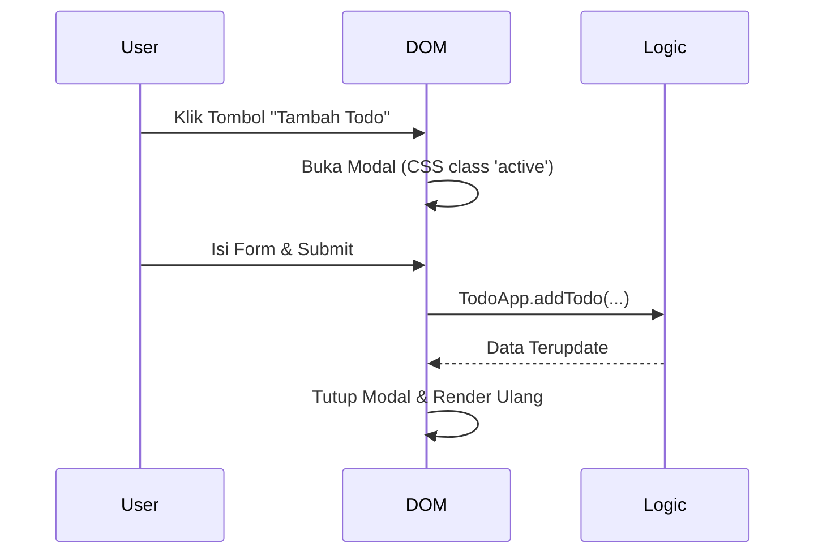

# 04 - UI / DOM

Modul ini bertanggung jawab merender data ke layar dan menangani interaksi pengguna.

## Diagram Interaksi


## Komponen UI Dinamis (Low Level)

### 1. Modal (Form Overlay)
Modal tidak perlu dibuat/dihapus dari DOM setiap kali. Cukup buat sekali di HTML dan atur visibilitasnya via CSS.

**HTML:**
```html
<div id="todo-modal" class="modal hidden">
  <form id="todo-form">...</form>
</div>
```

**CSS:**
```css
.modal { display: block; position: fixed; ... }
.hidden { display: none; }
```

**JavaScript (DOM Controller):**
```text
ALGORITHM ToggleModal(show):
    modal = document.getElementById('todo-modal')
    IF show IS TRUE:
        modal.classList.remove('hidden')
    ELSE:
        modal.classList.add('hidden')
        document.getElementById('todo-form').reset()
```

### 2. Sidebar (Proyek Navigasi)
Sidebar berfungsi untuk memilih proyek yang aktif. Saat sidebar diklik, *render* ulang area utama (`main-content`).

**Algoritma Sidebar:**
```text
ALGORITHM RenderSidebar(projects):
    sidebar = document.getElementById('sidebar')
    sidebar.innerHTML = '' // Bersihkan
    FOR EACH project IN projects:
        btn = CreateElement('button')
        btn.textContent = project.name
        btn.onclick = () => {
            currentProject = project
            RenderProjectTodos(currentProject)
        }
        sidebar.appendChild(btn)
```

## Aturan UI
1. **Delegasi Event:** Gunakan *Event Delegation* pada container utama agar lebih efisien.
2. **Modular Rendering:** Buat fungsi terpisah untuk merender `SidebarProjects`, `TodoContainer`, dan `TodoModalDetails`.
3. **Pemisahan:** Jika sebuah fungsi perlu mengubah data, panggil metode dari modul `logic`, jangan mengubah objek data secara langsung di dalam modul `dom`.
