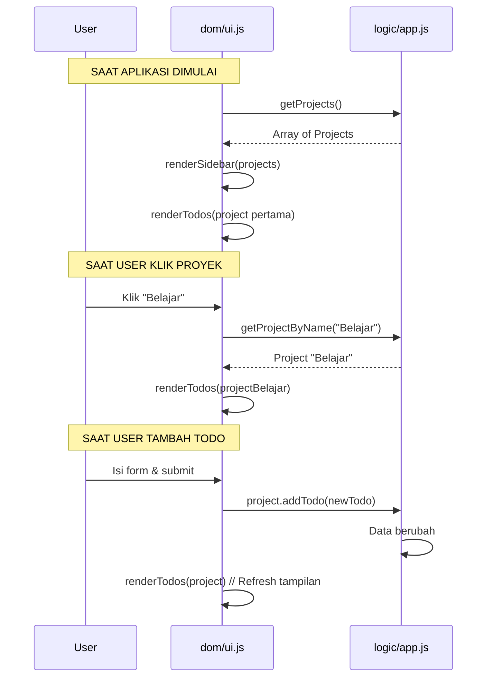
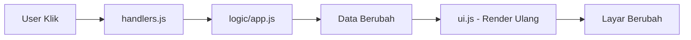

# Modul 04: Membangun Antarmuka (UI/DOM)

## 🎯 Tujuan Modul
Membuat tampilan aplikasi yang bisa dilihat dan diinteraksi oleh user. Modul ini akan:
1. Membuat layout dasar (Header, Sidebar, Konten Utama, Footer)
2. Menampilkan daftar proyek di Sidebar
3. Menampilkan daftar Todo di Konten Utama
4. Menangani interaksi user (klik, input form)

**Aturan PENTING:** Modul DOM hanya bertugas menampilkan data dan menangkap event. Semua logika bisnis tetap di `logic/`.

---

## 🧠 Diagram Alur Interaksi



---

## 📐 Langkah 1: Layout Halaman dengan CSS Grid

### Konsep CSS Grid

Bayangkan halaman web Anda adalah sebuah papan catur. CSS Grid memungkinkan Anda membagi papan menjadi baris dan kolom.

```mermaid
graph TD
    subgraph "Layout Halaman"
        H[Header - seluruh lebar]
        S[Sidebar 250px] | M[Main Content - sisa lebar]
        F[Footer - seluruh lebar]
    end
    
    style H fill:#5c4084,color:white
    style S fill:#f4f4f4,color:black
    style M fill:white,color:black
    style F fill:#5c4084,color:white
```

### Struktur HTML

Update file `index.html` Anda:

```html
<!-- index.html -->
<!doctype html>
<html lang="en">
  <head>
    <meta charset="UTF-8" />
    <meta name="viewport" content="width=device-width, initial-scale=1.0" />
    <link rel="icon" href="./src/assets/img/odin-logo.png" />
    <title>Odin Todo List</title>
  </head>
  <body>
    <div id="app">
      <!-- HEADER: Seluruh lebar, warna ungu -->
      <header>
        <h1>Odin Todo List</h1>
      </header>

      <!-- SIDEBAR: Kolom kiri, untuk daftar proyek -->
      <nav id="sidebar">
        <h2>Projects</h2>
        <!-- Daftar proyek akan diisi oleh JavaScript -->
        <div id="projects-list"></div>
        <button id="add-project-btn">+ New Project</button>
      </nav>

      <!-- MAIN CONTENT: Kolom kanan, untuk daftar Todo -->
      <main id="main-content">
        <!-- Konten akan diisi oleh JavaScript -->
      </main>

      <!-- FOOTER: Seluruh lebar -->
      <footer>&copy; Odin Todo List</footer>
    </div>
  </body>
</html>
```

### CSS Grid

Update file `src/assets/style.css`:

```css
/* ===========================
   RESET & LAYOUT DASAR
   =========================== */

/* Hapus margin bawaan browser */
* {
  margin: 0;
  padding: 0;
  box-sizing: border-box;
}

html, body {
  height: 100%;
  font-family: 'Segoe UI', Tahoma, Geneva, Verdana, sans-serif;
}

/* ===========================
   CSS GRID LAYOUT
   =========================== */

#app {
  display: grid;
  
  /* 2 kolom: sidebar 250px, main content sisanya */
  grid-template-columns: 250px 1fr;
  
  /* 3 baris: header 60px, main sisanya, footer 30px */
  grid-template-rows: 60px 1fr 30px;
  
  /* Tinggi penuh layar */
  height: 100vh;
}

/* HEADER: Bentang dari kolom 1 sampai akhir */
header {
  grid-column: 1 / -1;
  background: #5c4084;
  color: white;
  display: flex;
  align-items: center;
  padding-left: 24px;
}

/* SIDEBAR: Kolom 1 */
#sidebar {
  grid-column: 1 / 2;
  background: #f4f4f4;
  padding: 20px;
  border-right: 1px solid #ddd;
}

/* MAIN CONTENT: Kolom 2 */
#main-content {
  grid-column: 2 / 3;
  padding: 20px;
  overflow-y: auto;
}

/* FOOTER: Bentang penuh */
footer {
  grid-column: 1 / -1;
  background: #5c4084;
  color: white;
  text-align: center;
  line-height: 30px;
  font-size: 12px;
}
```

### Penjelasan CSS Grid

| Properti | Nilai | Arti |
|----------|-------|------|
| `grid-template-columns: 250px 1fr` | 2 kolom | Kolom 1 = 250px, Kolom 2 = sisa lebar |
| `grid-template-rows: 60px 1fr 30px` | 3 baris | Baris 1 = 60px, Baris 2 = sisa tinggi, Baris 3 = 30px |
| `grid-column: 1 / -1` | Bentang penuh | Mulai kolom 1 sampai kolom terakhir |

---

## 🎨 Langkah 2: Styling Komponen

Tambahkan styling berikut di `style.css` untuk membuat komponen terlihat lebih rapi:

```css
/* ===========================
   SIDEBAR
   =========================== */

#sidebar h2 {
  margin-bottom: 16px;
  font-size: 18px;
  color: #333;
}

#projects-list {
  display: flex;
  flex-direction: column;
  gap: 4px;
  margin-bottom: 16px;
}

.project-btn {
  display: block;
  width: 100%;
  padding: 10px 12px;
  background: white;
  border: 1px solid #ddd;
  border-radius: 6px;
  text-align: left;
  cursor: pointer;
  font-size: 14px;
  transition: background 0.2s;
}

.project-btn:hover {
  background: #e8e0f0;
}

.project-btn.active {
  background: #5c4084;
  color: white;
  border-color: #5c4084;
}

#add-project-btn {
  width: 100%;
  padding: 10px;
  background: #5c4084;
  color: white;
  border: none;
  border-radius: 6px;
  cursor: pointer;
  font-size: 14px;
}

#add-project-btn:hover {
  background: #4a3369;
}

/* ===========================
   MAIN CONTENT (TODOS)
   =========================== */

.todo-header {
  display: flex;
  justify-content: space-between;
  align-items: center;
  margin-bottom: 16px;
}

.todo-header h2 {
  font-size: 22px;
  color: #333;
}

#add-todo-btn {
  padding: 8px 16px;
  background: #5c4084;
  color: white;
  border: none;
  border-radius: 6px;
  cursor: pointer;
  font-size: 14px;
}

.todo-card {
  background: #f9f9f9;
  border: 1px solid #eee;
  border-radius: 8px;
  padding: 12px 16px;
  margin-bottom: 8px;
  display: flex;
  justify-content: space-between;
  align-items: center;
}

.todo-card:hover {
  border-color: #5c4084;
}

.todo-title {
  font-size: 16px;
  font-weight: 500;
}

.todo-due-date {
  font-size: 12px;
  color: #888;
}

.todo-priority {
  font-size: 11px;
  padding: 2px 8px;
  border-radius: 10px;
  font-weight: 600;
}

.priority-low {
  background: #e8f5e9;
  color: #2e7d32;
}

.priority-medium {
  background: #fff3e0;
  color: #e65100;
}

.priority-high {
  background: #fbe9e7;
  color: #c62828;
}

.delete-btn {
  background: none;
  border: none;
  color: #ccc;
  cursor: pointer;
  font-size: 18px;
  padding: 4px 8px;
}

.delete-btn:hover {
  color: #c62828;
}
```

---

## 📝 Langkah 3: Membuat Modal Form

Modal adalah jendela pop-up yang muncul di atas halaman untuk mengisi data. Modal lebih baik daripada `prompt()` karena:
- Tampilannya lebih profesional
- Bisa punya banyak field input
- User bisa membatalkan (klik di luar modal atau tombol close)

### Struktur Modal di HTML

Tambahkan kode berikut di `index.html`, **setelah** tag penutup `</div>` dari `#app` (di dalam `<body>`):

```html
<!-- MODAL OVERLAY -->
<div id="modal-overlay" class="modal-overlay hidden">
  <div class="modal-box">
    <div class="modal-header">
      <h3 id="modal-title">Add New</h3>
      <button id="modal-close-btn" class="modal-close">&times;</button>
    </div>
    <form id="modal-form">
      <div id="modal-fields">
        <!-- Fields akan diisi oleh JavaScript -->
      </div>
      <button type="submit" id="modal-submit-btn" class="modal-submit">Save</button>
    </form>
  </div>
</div>
```

### Styling Modal di CSS

Tambahkan CSS berikut ke `style.css`:

```css
/* ===========================
   MODAL OVERLAY
   =========================== */

.modal-overlay {
  position: fixed;
  top: 0;
  left: 0;
  width: 100%;
  height: 100%;
  background: rgba(0, 0, 0, 0.5);
  display: flex;
  justify-content: center;
  align-items: center;
  z-index: 1000;
}

.modal-overlay.hidden {
  display: none;
}

.modal-box {
  background: white;
  border-radius: 12px;
  width: 420px;
  max-width: 90%;
  box-shadow: 0 10px 30px rgba(0, 0, 0, 0.3);
}

.modal-header {
  display: flex;
  justify-content: space-between;
  align-items: center;
  padding: 16px 20px;
  border-bottom: 1px solid #eee;
}

.modal-header h3 {
  margin: 0;
  font-size: 18px;
  color: #333;
}

.modal-close {
  background: none;
  border: none;
  font-size: 24px;
  cursor: pointer;
  color: #999;
  padding: 0;
  line-height: 1;
}

.modal-close:hover {
  color: #333;
}

#modal-form {
  padding: 20px;
}

.form-group {
  margin-bottom: 14px;
}

.form-group label {
  display: block;
  font-size: 13px;
  font-weight: 600;
  color: #555;
  margin-bottom: 4px;
}

.form-group input,
.form-group select,
.form-group textarea {
  width: 100%;
  padding: 8px 10px;
  border: 1px solid #ddd;
  border-radius: 6px;
  font-size: 14px;
  font-family: inherit;
}

.form-group input:focus,
.form-group select:focus,
.form-group textarea:focus {
  outline: none;
  border-color: #5c4084;
}

.modal-submit {
  width: 100%;
  padding: 10px;
  background: #5c4084;
  color: white;
  border: none;
  border-radius: 6px;
  font-size: 14px;
  cursor: pointer;
  margin-top: 8px;
}

.modal-submit:hover {
  background: #4a3369;
}
```

### Controller Modal di `ui.js`

Fungsi-fungsi berikut akan mengatur tampilan modal. Fungsi-fungsi ini ditambahkan ke dalam file `src/dom/ui.js`:

```javascript
/**
 * ========================================
 *  MODAL CONTROLLER
 * ========================================
 */

/**
 * Menampilkan modal dengan judul dan field input tertentu.
 * @param {string} title - Judul modal (misal: "Add Todo")
 * @param {string} fieldsHTML - HTML string untuk field input di dalam form
 */
export const showModal = (title, fieldsHTML) => {
  const overlay = document.getElementById('modal-overlay');
  document.getElementById('modal-title').textContent = title;
  document.getElementById('modal-fields').innerHTML = fieldsHTML;
  overlay.classList.remove('hidden');
};

/**
 * Menyembunyikan modal dan mereset form.
 */
export const hideModal = () => {
  const overlay = document.getElementById('modal-overlay');
  overlay.classList.add('hidden');
  document.getElementById('modal-form').reset();
};

/**
 * Mengambil data dari form modal berdasarkan ID field.
 * @param {string[]} fieldIds - Array ID field yang akan diambil nilainya
 * @returns {object} Object berisi data dari form
 */
export const getModalData = (fieldIds) => {
  const data = {};
  fieldIds.forEach(id => {
    const el = document.getElementById(id);
    if (el) data[id] = el.value;
  });
  return data;
};
```

**Penjelasan:**
- `showModal`: Menerima judul dan HTML field, lalu menampilkan modal.
- `hideModal`: Menyembunyikan modal dan mereset input.
- `getModalData`: Membaca nilai dari field-field di dalam form dan mengembalikannya sebagai objek.

---

## 🧩 Langkah 4: Render Sidebar (`src/dom/ui.js`)

Sekarang kita buat fungsi untuk menampilkan data ke layar.

### Apa itu fungsi render?
Fungsi render = mengubah data JavaScript menjadi elemen HTML.

**Konsep:**
```javascript
// Data (dari logic)
const projects = [
  { name: "Default" },
  { name: "Pekerjaan" }
];

// Fungsi render mengubah data menjadi HTML
// <button class="project-btn">Default</button>
// <button class="project-btn">Pekerjaan</button>
```

### Instruksi

Buat file `src/dom/ui.js`:

```javascript
// src/dom/ui.js
import { getProjects } from '../logic/app.js';
import { setActiveProject } from './handlers.js';

/**
 * ========================================
 *  RENDER FUNCTIONS
 *  Tugas: Menerima data, menghasilkan HTML
 * ========================================
 */

/**
 * Merender daftar proyek ke dalam sidebar.
 * Fungsi ini:
 * 1. Mengosongkan kontainer proyek
 * 2. Mendapatkan data proyek dari app.js
 * 3. Membuat tombol untuk setiap proyek
 * 4. Menambahkan tombol ke dalam kontainer
 */
export const renderSidebar = () => {
  const container = document.getElementById('projects-list');
  const projects = getProjects();

  // Kosongkan kontainer
  container.innerHTML = '';

  // Buat tombol untuk setiap proyek
  projects.forEach(project => {
    const btn = document.createElement('button');
    btn.textContent = project.name;
    btn.classList.add('project-btn');
    
    // Event: saat diklik, render todo dari proyek ini
    btn.addEventListener('click', () => {
      setActiveProject(project);
      renderTodos(project);
    });

    container.appendChild(btn);
  });
};

/**
 * Merender daftar Todo dari suatu proyek ke dalam main content.
 * @param {object} project - Objek proyek yang akan ditampilkan todos-nya
 */
export const renderTodos = (project) => {
  const container = document.getElementById('main-content');

  // Buat header dengan judul proyek
  container.innerHTML = `
    <div class="todo-header">
      <h2>${project.name}</h2>
      <button id="add-todo-btn">+ Add Todo</button>
    </div>
  `;

  // Buat card untuk setiap todo
  project.todos.forEach(todo => {
    const card = document.createElement('div');
    card.classList.add('todo-card');
    
    // Warna prioritas
    let priorityClass = 'priority-low';
    if (todo.priority === 'medium') priorityClass = 'priority-medium';
    if (todo.priority === 'high') priorityClass = 'priority-high';

    card.innerHTML = `
      <div>
        <div class="todo-title">${todo.title}</div>
        <div class="todo-due-date">${todo.dueDate || 'No date'}</div>
      </div>
      <div style="display: flex; align-items: center; gap: 8px;">
        <span class="todo-priority ${priorityClass}">${todo.priority}</span>
        <button class="delete-btn" data-id="${todo.id}">&times;</button>
      </div>
    `;

    container.appendChild(card);
  });
};
```

### Penjelasan Detail

**Fungsi `renderSidebar()`:**

```javascript
const container = document.getElementById('projects-list');
```
Mencari elemen HTML yang memiliki `id="projects-list"`. Di sinilah tombol-tombol proyek akan ditempatkan.

```javascript
projects.forEach(project => { ... });
```
`forEach` adalah method array yang menjalankan fungsi untuk setiap elemen. Sama seperti: "Untuk setiap proyek dalam daftar, lakukan ini:"

```javascript
btn.addEventListener('click', () => {
  renderTodos(project);
});
```
Saat tombol diklik, panggil fungsi `renderTodos` dengan proyek yang sesuai.

**Fungsi `renderTodos(project)`:**

```javascript
container.innerHTML = `...`;
```
`innerHTML` mengubah isi HTML dari suatu elemen. Kita gunakan ini untuk:
1. Membersihkan konten lama.
2. Mengisi dengan konten baru (header proyek).

**Template Literal (Backtick `` ` ``):**

Perhatikan kode `` `<h2>${project.name}</h2>` ``. Ini adalah **template literal** — cara memasukkan variabel ke dalam string. `${project.name}` akan diganti dengan nilai `project.name`.

---

## 🖱️ Langkah 5: Event Handlers (`src/dom/handlers.js`)

File ini menghubungkan aksi user (klik tombol) dengan logika data. Tidak ada `prompt()` lagi — semua input melalui modal.

Buat file `src/dom/handlers.js`:

```javascript
// src/dom/handlers.js
import { addProject, addTodoToProject, removeTodoFromProject, getProjectByName } from '../logic/app.js';
import { createTodo } from '../logic/todo.js';
import { renderSidebar, renderTodos, showModal, hideModal, getModalData } from './ui.js';

/**
 * ========================================
 *  EVENT HANDLERS
 *  Tugas: Menangkap interaksi user,
 *         memanggil logic, lalu merender ulang
 * ========================================
 */

/** Menyimpan proyek yang sedang aktif (terakhir diklik) */
let activeProject = null;

export const setActiveProject = (project) => {
  activeProject = project;
};

/**
 * Menampilkan modal untuk menambah proyek baru.
 */
export const handleAddProject = () => {
  const fields = `
    <div class="form-group">
      <label for="project-name">Project Name</label>
      <input type="text" id="project-name" required />
    </div>
  `;
  showModal('New Project', fields);
};

/**
 * Menampilkan modal untuk menambah Todo baru.
 */
export const handleAddTodo = () => {
  if (!activeProject) return;

  const fields = `
    <div class="form-group">
      <label for="todo-title">Title</label>
      <input type="text" id="todo-title" required />
    </div>
    <div class="form-group">
      <label for="todo-desc">Description</label>
      <textarea id="todo-desc" rows="3"></textarea>
    </div>
    <div class="form-group">
      <label for="todo-date">Due Date</label>
      <input type="date" id="todo-date" />
    </div>
    <div class="form-group">
      <label for="todo-priority">Priority</label>
      <select id="todo-priority">
        <option value="low">Low</option>
        <option value="medium" selected>Medium</option>
        <option value="high">High</option>
      </select>
    </div>
  `;
  showModal('Add Todo', fields);
};

/**
 * Memproses submit form modal.
 * Dipanggil saat tombol "Save" di modal diklik.
 */
export const handleModalSubmit = () => {
  const title = document.getElementById('modal-title').textContent;

  if (title === 'New Project') {
    const data = getModalData(['project-name']);
    if (data['project-name'].trim()) {
      addProject(data['project-name'].trim());
      renderSidebar();
      hideModal();
    }
  }

  if (title === 'Add Todo') {
    const data = getModalData(['todo-title', 'todo-desc', 'todo-date', 'todo-priority']);
    if (data['todo-title'].trim()) {
      const newTodo = createTodo(
        data['todo-title'].trim(),
        data['todo-desc'].trim(),
        data['todo-date'],
        data['todo-priority']
      );
      addTodoToProject(activeProject.name, newTodo);
      const updatedProject = getProjectByName(activeProject.name);
      renderTodos(updatedProject);
      hideModal();
    }
  }
};

/**
 * Menghapus Todo dari proyek.
 * @param {string} projectName - Nama proyek
 * @param {string} todoId - ID todo yang dihapus
 */
export const handleDeleteTodo = (projectName, todoId) => {
  removeTodoFromProject(projectName, todoId);
  const updatedProject = getProjectByName(projectName);
  renderTodos(updatedProject);
};
```

---

## 🔗 Langkah 6: Integrasi di `src/index.js`

File `index.js` adalah "konduktor orkestra". Tugasnya:
1. Mengimpor semua fungsi yang diperlukan
2. Menjalankan render awal
3. Memasang event listener (termasuk modal)

```javascript
// src/index.js
import './assets/style.css';
import { getProjects } from './logic/app.js';
import { renderSidebar, renderTodos, hideModal } from './dom/ui.js';
import {
  handleAddProject,
  handleAddTodo,
  handleDeleteTodo,
  handleModalSubmit,
  setActiveProject
} from './dom/handlers.js';

/**
 * ========================================
 *  INISIALISASI APLIKASI
 * ========================================
 * Fungsi ini dipanggil saat halaman selesai dimuat.
 */
const init = () => {
  // Render sidebar dengan daftar proyek
  renderSidebar();

  // Render todo dari proyek pertama (Default)
  const projects = getProjects();
  if (projects.length > 0) {
    renderTodos(projects[0]);
    setActiveProject(projects[0]);
  }

  // --- PASANG EVENT LISTENER ---

  // Tombol "+ New Project" di sidebar
  document.getElementById('add-project-btn').addEventListener('click', () => {
    handleAddProject();
  });

  // Tombol close modal (×)
  document.getElementById('modal-close-btn').addEventListener('click', hideModal);

  // Submit form modal
  document.getElementById('modal-form').addEventListener('submit', (e) => {
    e.preventDefault(); // Mencegah refresh halaman
    handleModalSubmit();
  });

  // Klik di luar modal → tutup modal
  document.getElementById('modal-overlay').addEventListener('click', (e) => {
    if (e.target === document.getElementById('modal-overlay')) {
      hideModal();
    }
  });

  // Event delegation untuk tombol yang dibuat secara dinamis
  document.getElementById('main-content').addEventListener('click', (e) => {
    
    // Tombol "+ Add Todo"
    if (e.target.id === 'add-todo-btn') {
      handleAddTodo();
    }

    // Tombol "Delete" (×)
    if (e.target.classList.contains('delete-btn')) {
      const projectName = document.querySelector('.todo-header h2').textContent;
      handleDeleteTodo(projectName, e.target.dataset.id);
    }
  });
};

// Jalankan saat DOM siap
document.addEventListener('DOMContentLoaded', init);
```

### Penjelasan Event Modal

```javascript
document.getElementById('modal-form').addEventListener('submit', (e) => {
  e.preventDefault();
  handleModalSubmit();
});
```

- `e.preventDefault()`: Mencegah form mengirim data dan me-refresh halaman (perilaku default HTML).
- `handleModalSubmit()`: Membaca judul modal (via `document.getElementById('modal-title').textContent`) untuk menentukan apakah ini modal "New Project" atau "Add Todo", lalu memproses sesuai jenisnya.

```javascript
document.getElementById('modal-overlay').addEventListener('click', (e) => {
  if (e.target === document.getElementById('modal-overlay')) {
    hideModal();
  }
});
```

Ini adalah event delegation untuk klik di luar modal. Jika user klik *background* gelap (bukan di dalam kotak putih modal), modal akan tertutup.

### Penjelasan Event Delegation

```javascript
document.getElementById('main-content').addEventListener('click', (e) => {
  if (e.target.id === 'add-todo-btn') { ... }
  if (e.target.classList.contains('delete-btn')) { ... }
});
```

**Apa itu Event Delegation?** 
Bayangkan Anda adalah satpam di pintu masuk gedung. Setiap orang yang masuk harus Anda periksa. Anda tidak perlu berdiri di depan setiap pintu ruangan — cukup di pintu utama.

Di kode kita:
- Kita pasang SATU event listener di `#main-content` (pintu utama).
- Saat ada klik, kita cek siapa yang diklik (`e.target`).
- Jika yang diklik adalah tombol `#add-todo-btn` → panggil `handleAddTodo`.
- Jika yang diklik adalah `.delete-btn` → panggil `handleDeleteTodo`.

**Kenapa tidak pasang event di setiap tombol?** Karena tombol-tombol itu dibuat *secara dinamis* oleh JavaScript. Akan merepotkan jika harus pasang event setiap kali membuat tombol baru. Event delegation lebih efisien.

---

## 🚀 Langkah 7: Jalankan!

```bash
npm run start
```

**Yang akan Anda lihat:**
1. Halaman dengan layout Grid: Header ungu, Sidebar di kiri, Konten di kanan, Footer di bawah.
2. Sidebar menampilkan tombol "Default" dan "+ New Project".
3. Konten utama menampilkan header "Default" dan tombol "+ Add Todo".
4. Belum ada Todo — karena proyek Default masih kosong.

**Coba interaksi:**
- Klik "+ New Project" → masukkan nama proyek → lihat sidebar bertambah.
- Klik proyek di sidebar → konten utama berganti.
- Klik "+ Add Todo" → isi data → lihat Todo muncul.

---

## 📖 Ringkasan

| File | Fungsi |
|------|--------|
| `index.html` | Struktur layout dasar |
| `style.css` | Styling layout dan komponen |
| `src/dom/ui.js` | Fungsi render (ubah data → HTML) |
| `src/dom/handlers.js` | Fungsi event (tambah/hapus data) |
| `src/index.js` | Integrasi dan inisialisasi |

**Alur Data:**



**Lanjut ke Modul 05:** Menyimpan data dengan localStorage.
