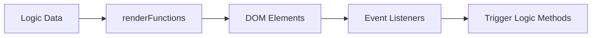

# 04 - UI / DOM

Modul ini bertanggung jawab merender data ke layar.

## Diagram Alur Rendering


## Algoritma Render
```text
ALGORITHM RenderProject(project):
    1. clearContainer(todoListContainer)
    2. FOR EACH todo IN project.todos:
        a. todoElement = CreateElement('div')
        b. todoElement.textContent = todo.title
        c. AddColorByPriority(todoElement, todo.priority)
        d. Append todoElement TO todoListContainer
```
