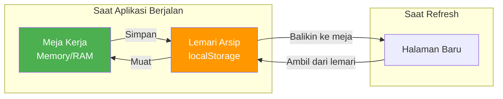
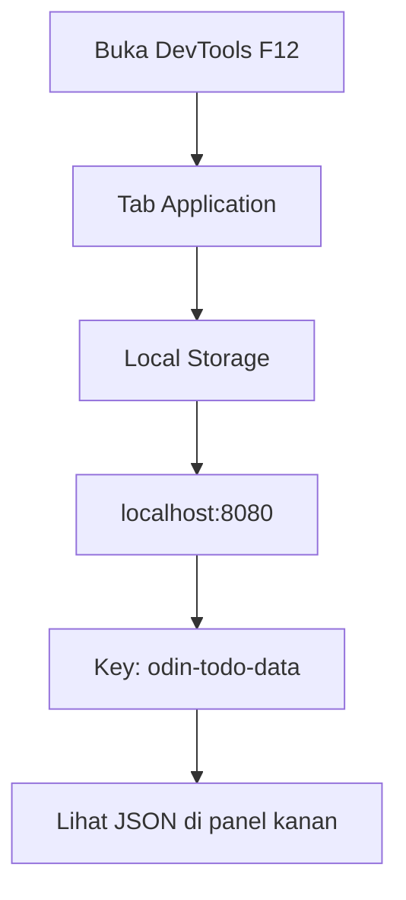

# Modul 05: Menyimpan Data dengan localStorage

## 🎯 Tujuan Modul
Membuat data aplikasi tetap ada meskipun halaman di-refresh. Tanpa modul ini, setiap kali Anda me-refresh browser, semua Todo dan Project akan hilang.

---

## 🧠 Konsep: Bagaimana localStorage Bekerja

### Analogi: Lemari Arsip

Bayangkan aplikasi Anda adalah sebuah meja kerja. Saat Anda bekerja, data ada di atas meja (di memori). Tapi saat Anda pulang (refresh halaman), meja dibersihkan.

**localStorage** adalah lemari arsip di samping meja Anda. Setiap kali selesai bekerja, Anda memasukkan data ke lemari. Setiap kali datang, Anda mengeluarkan data dari lemari ke meja.



### Cara Kerja localStorage

| Method | Fungsi | Contoh |
|--------|--------|--------|
| `localStorage.setItem(key, value)` | Menyimpan data | `localStorage.setItem('name', 'John')` |
| `localStorage.getItem(key)` | Mengambil data | `localStorage.getItem('name')` → 'John' |
| `localStorage.removeItem(key)` | Menghapus data | `localStorage.removeItem('name')` |
| `localStorage.clear()` | Hapus semua data | `localStorage.clear()` |

**PENTING:** localStorage hanya bisa menyimpan **string**. Untuk menyimpan objek/array, kita harus ubah ke JSON dulu.

---

## 📦 Langkah 1: Memahami JSON (JavaScript Object Notation)

JSON adalah format teks untuk merepresentasikan data. Ini adalah "jembatan" antara objek JavaScript dan localStorage.

### Contoh Konversi

```javascript
// Objek JavaScript
const todo = {
  id: "123",
  title: "Belajar Webpack",
  isCompleted: false,
};

// Ubah ke JSON string
const jsonString = JSON.stringify(todo);
console.log(jsonString);
// Output: {"id":"123","title":"Belajar Webpack","isCompleted":false}

// Kembalikan ke objek
const parsedTodo = JSON.parse(jsonString);
console.log(parsedTodo.title);
// Output: Belajar Webpack
```

### Masalah: Method Hilang!

Perhatikan contoh berikut:

```javascript
// Objek dengan method
const project = {
  name: "Belajar",
  todos: [],
  addTodo(todo) { this.todos.push(todo); },
};

const json = JSON.stringify(project);
const parsed = JSON.parse(json);

console.log(parsed.addTodo);
// Output: undefined  ← METHOD HILANG!
```

**Mengapa?** JSON hanya menyimpan data (properti), bukan fungsi (method). Saat kita `stringify` lalu `parse`, method `addTodo` hilang.

**Solusi:** Kita harus "memasangkan kembali" method setelah data di-load. Di sinilah keunggulan Factory Function: kita cukup panggil `createProject` lagi untuk membuat ulang project dengan method yang utuh.

---

## 🗄️ Langkah 2: Membuat Modul Storage

Buat file `src/logic/storage.js`:

```javascript
// src/logic/storage.js
import { createProject } from './project.js';
import { createTodo } from './todo.js';

/**
 * ========================================
 *  LOCALSTORAGE MANAGER
 *  Tugas: Menyimpan dan memuat data
 * ========================================
 */

// Kunci (key) untuk menyimpan data di localStorage
const STORAGE_KEY = 'odin-todo-data';

/**
 * Menyimpan data proyek ke localStorage.
 * @param {Array} projects - Array proyek yang akan disimpan
 */
export const saveProjects = (projects) => {
  try {
    // Ubah array proyek menjadi string JSON
    const jsonString = JSON.stringify(projects);
    // Simpan ke localStorage
    localStorage.setItem(STORAGE_KEY, jsonString);
  } catch (error) {
    console.error('Gagal menyimpan data:', error);
  }
};

/**
 * Memuat data proyek dari localStorage.
 * Mengembalikan array proyek dengan method yang sudah dipasang kembali.
 * @returns {Array} Array proyek (atau array kosong jika tidak ada data)
 */
export const loadProjects = () => {
  try {
    // Ambil data dari localStorage
    const jsonString = localStorage.getItem(STORAGE_KEY);

    // Jika tidak ada data, kembalikan array kosong
    if (!jsonString) return [];

    // Ubah string JSON menjadi array biasa (tanpa method)
    const rawProjects = JSON.parse(jsonString);

    // REKONSTRUKSI: Pasang method kembali
    const projects = rawProjects.map(rawProject => {
      // Buat ulang project dengan factory function
      const project = createProject(rawProject.name);

      // Buat ulang setiap todo dengan factory function
      project.todos = rawProject.todos.map(rawTodo => {
        return createTodo(
          rawTodo.title,
          rawTodo.description,
          rawTodo.dueDate,
          rawTodo.priority
        );
      });

      return project;
    });

    return projects;

  } catch (error) {
    console.error('Gagal memuat data:', error);
    return []; // Jika error, kembalikan array kosong (aplikasi tetap jalan)
  }
};

/**
 * Menghapus semua data dari localStorage.
 */
export const clearProjects = () => {
  localStorage.removeItem(STORAGE_KEY);
};
```

### Penjelasan Detail

**Bagian `saveProjects`:**
```javascript
export const saveProjects = (projects) => {
  const jsonString = JSON.stringify(projects);
  localStorage.setItem(STORAGE_KEY, jsonString);
};
```
1. `JSON.stringify(projects)` mengubah array proyek (beserta semua todo di dalamnya) menjadi string JSON.
2. `localStorage.setItem(...)` menyimpan string tersebut ke browser dengan nama kunci `'odin-todo-data'`.

**Mengapa dibungkus `try...catch`?** Untuk keamanan. Ada kalanya localStorage penuh atau tidak tersedia. Dengan `try...catch`, aplikasi tidak akan crash jika penyimpanan gagal.

**Bagian `loadProjects`:**
```javascript
const rawProjects = JSON.parse(jsonString);
```
`JSON.parse` mengubah string JSON kembali menjadi array. Tapi array ini **tanpa method** (ingat, method hilang saat stringify).

```javascript
const projects = rawProjects.map(rawProject => {
  const project = createProject(rawProject.name);
  project.todos = rawProject.todos.map(rawTodo => {
    return createTodo(rawTodo.title, rawTodo.description, rawTodo.dueDate, rawTodo.priority);
  });
  return project;
});
```

**Apa itu `map`?** `map` membuat array baru dengan menjalankan fungsi pada setiap elemen.

**Proses rekonstruksi:**
1. Ambil satu proyek mentah (`rawProject`).
2. Panggil `createProject(rawProject.name)` → dapat proyek baru dengan method utuh.
3. Untuk setiap todo mentah di dalamnya, panggil `createTodo(...)` → dapat todo baru dengan method utuh.
4. Masukkan todo-todo baru ke `project.todos`.
5. Kembalikan proyek yang sudah jadi.

**Mengapa `JSON.parse` dibungkus `try...catch`?** Jika data di localStorage rusak (misal: diedit manual oleh user), `JSON.parse` akan error. Dengan `try...catch`, aplikasi tetap berjalan dengan data kosong.

---

## 🔗 Langkah 3: Integrasi dengan App Controller

Update file `src/logic/app.js` untuk menggunakan storage:

```javascript
// src/logic/app.js
import { createProject } from './project.js';
import { saveProjects, loadProjects } from './storage.js';

/**
 * ========================================
 *  PUSAT DATA APLIKASI (Single Source of Truth)
 * ========================================
 */

// --- STATE (Data) ---
let projects = [];

/**
 * INISIALISASI: Muat data dari localStorage.
 * Jika tidak ada data, buat proyek Default.
 */
const initData = () => {
  const saved = loadProjects();
  if (saved.length > 0) {
    projects = saved;
  } else {
    projects.push(createProject("Default"));
    saveProjects(projects); // Simpan ke localStorage
  }
};

// Jalankan inisialisasi
initData();

/**
 * Menambahkan proyek baru.
 * @param {string} name - Nama proyek baru
 */
export const addProject = (name) => {
  const newProject = createProject(name);
  projects.push(newProject);
  saveProjects(projects); // ← SIMPAN SETELAH BERUBAH
};

/**
 * Mengembalikan semua proyek.
 * @returns {Array}
 */
export const getProjects = () => {
  return projects;
};

/**
 * Mencari proyek berdasarkan nama.
 * @param {string} name
 * @returns {object|undefined}
 */
export const getProjectByName = (name) => {
  return projects.find(project => project.name === name);
};

/**
 * Menghapus proyek berdasarkan nama.
 * @param {string} name
 */
export const removeProject = (name) => {
  projects = projects.filter(project => project.name !== name);
  saveProjects(projects); // ← SIMPAN SETELAH BERUBAH
};

/**
 * Menambahkan Todo ke dalam proyek tertentu.
 * @param {string} projectName - Nama proyek tujuan
 * @param {object} todo - Objek Todo
 */
export const addTodoToProject = (projectName, todo) => {
  const project = getProjectByName(projectName);
  if (project) {
    project.addTodo(todo);
    saveProjects(projects); // ← SIMPAN
  }
};

/**
 * Menghapus Todo dari proyek tertentu.
 * @param {string} projectName - Nama proyek
 * @param {string} todoId - ID Todo yang dihapus
 */
export const removeTodoFromProject = (projectName, todoId) => {
  const project = getProjectByName(projectName);
  if (project) {
    project.removeTodo(todoId);
    saveProjects(projects); // ← SIMPAN
  }
};
```

---

## 🔄 Langkah 4: Update Event Handlers

Update file `src/dom/handlers.js` untuk menggunakan fungsi baru dari `app.js`:

```javascript
// src/dom/handlers.js
import { addProject, addTodoToProject, removeTodoFromProject, getProjectByName } from '../logic/app.js';
import { createTodo } from '../logic/todo.js';
import { renderSidebar, renderTodos } from './ui.js';

/**
 * Menangani klik tombol "+ New Project"
 */
export const handleAddProject = () => {
  const name = prompt('Enter project name:');
  if (name && name.trim() !== '') {
    addProject(name.trim()); // ← Sudah otomatis menyimpan ke localStorage
    renderSidebar();
  }
};

/**
 * Menangani klik tombol "+ Add Todo"
 * @param {object} project - Proyek yang sedang aktif
 */
export const handleAddTodo = (project) => {
  const title = prompt('Enter todo title:');
  if (!title || title.trim() === '') return;

  const description = prompt('Enter description (optional):') || '';
  const dueDate = prompt('Enter due date (YYYY-MM-DD, optional):') || '';
  const priority = prompt('Enter priority (low/medium/high):') || 'low';

  // Tambah todo via app.js (yang akan menyimpan ke localStorage)
  addTodoToProject(project.name, createTodo(title.trim(), description, dueDate, priority));
  
  // Render ulang dengan data terbaru
  const updatedProject = getProjectByName(project.name);
  renderTodos(updatedProject);
};

/**
 * Menghapus Todo dari proyek.
 * @param {string} projectName - Nama proyek
 * @param {string} todoId - ID todo yang dihapus
 */
export const handleDeleteTodo = (projectName, todoId) => {
  removeTodoFromProject(projectName, todoId);
  const updatedProject = getProjectByName(projectName);
  renderTodos(updatedProject);
};
```

---

## 🧪 Langkah 5: Uji Coba

### Skenario 1: Data Bertahan Setelah Refresh

1. Jalankan `npm run start`.
2. Tambah proyek baru (misal: "Pekerjaan").
3. Tambah Todo ke proyek tersebut.
4. **Refresh halaman** (F5).
5. **Harapannya:** Proyek "Pekerjaan" dan Todo-nya masih ada.

### Skenario 2: Cek Data di DevTools

1. Buka DevTools (F12).
2. Buka tab **Application** (mungkin perlu klik ">>" jika tidak terlihat).
3. Di panel kiri, klik **Local Storage** → pilih domain Anda (localhost:8080).
4. Anda akan melihat data dengan key `odin-todo-data`.
5. Klik data tersebut untuk melihat isinya dalam format JSON.



### Skenario 3: Aplikasi Tidak Crash Jika Data Rusak

1. Buka DevTools → Application → Local Storage.
2. Klik dua kali pada nilai `odin-todo-data`.
3. Hapus isinya dan ganti dengan teks acak: `abc123`.
4. Refresh halaman.
5. **Harapannya:** Aplikasi tetap berjalan dengan proyek Default (tidak crash).

---

## 📖 Ringkasan Alur Data Lengkap

```mermaid
graph TD
    subgraph "Saat Aplikasi Dimulai"
        A[localStorage] -->|loadProjects| B[app.js: projects[]]
        B --> C[ui.js: renderSidebar]
        B --> D[ui.js: renderTodos]
    end
    
    subgraph "Saat User Berinteraksi"
        E[User klik tombol] --> F[handlers.js]
        F -->|addProject| G[app.js: ubah data]
        F -->|addTodo| G
        F -->|deleteTodo| G
        G -->|saveProjects| A
        G -->|data baru| H[ui.js: render ulang]
    end
    
    style A fill:#FF9800,color:white
    style B fill:#5c4084,color:white
    style G fill:#5c4084,color:white
```

---

## ✅ Tugas Anda

1. Buat file `src/logic/storage.js` → implementasi `saveProjects` dan `loadProjects`.
2. Update `src/logic/app.js` → tambahkan inisialisasi dan auto-save.
3. Update `src/dom/handlers.js` → gunakan fungsi baru dari `app.js`.
4. **Uji coba:** Tambah data, refresh, lihat apakah data masih ada.

---

## 🎉 Selamat!

Anda telah menyelesaikan seluruh modul aplikasi Todo List:

| Modul | Status | Fungsi |
|-------|--------|--------|
| Modul 01 | ✅ | Setup Webpack & lingkungan |
| Modul 02 | ✅ | Factory: Todo & Project |
| Modul 03 | ✅ | Controller: app.js |
| Modul 04 | ✅ | Tampilan: UI & Event |
| Modul 05 | ✅ | Penyimpanan: localStorage |

**Apa yang bisa dikembangkan selanjutnya?**
- Tampilan modal form yang lebih baik (ganti `prompt()`)
- Fitur edit Todo
- Sorting berdasarkan prioritas atau tanggal
- Tampilan mobile responsive

---

## ❓ Troubleshooting

| Masalah | Penyebab | Solusi |
|---------|----------|--------|
| Data hilang setelah refresh | `saveProjects` tidak dipanggil | Pastikan setiap perubahan data memanggil `saveProjects` |
| Error: "JSON.parse unexpected token" | Data di localStorage rusak | Hapus data di DevTools → Application → Local Storage, lalu refresh |
| Method `addTodo` tidak ada | Rekonstruksi tidak dilakukan | Pastikan `loadProjects` memanggil `createProject` dan `createTodo` |
| Aplikasi blank/macet | Ada error di console | Cek Console DevTools (F12) untuk pesan error |
