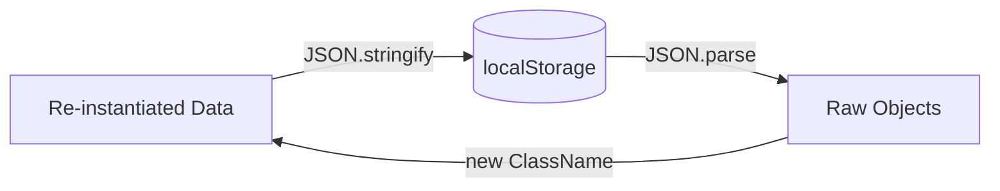

# 05 - Persistence (`localStorage`)

Data harus dipersistenkan agar tidak hilang saat refresh halaman.

## Diagram Alur Data


## Algoritma Re-instantiation (Deserialization)
Karena `JSON.parse` menghilangkan *method* (fungsi) dari objek, kita harus membuatnya kembali.

```text
ALGORITHM LoadFromStorage():
    1. rawData = localStorage.getItem('todoData')
    2. IF rawData IS NULL RETURN InitializeDefaultApp()
    
    3. parsedData = JSON.parse(rawData)
    4. projects = []
    
    5. FOR EACH projData IN parsedData.projects:
        a. newProj = NEW Project(projData.name)
        b. FOR EACH todoData IN projData.todos:
            c. newTodo = NEW Todo(todoData.title, ...)
            d. newTodo.isDone = todoData.isDone // Restore state
            e. newProj.addTodo(newTodo)
        f. projects.push(newProj)
        
    6. RETURN projects
```

## Aturan Persistence
1. **Safety:** Selalu gunakan `try...catch` saat melakukan `JSON.parse` untuk menghindari crash jika data di `localStorage` rusak (malformed).
2. **Frequency:** Simpan ke `localStorage` (`Storage.saveAll()`) setiap kali ada perubahan data (tambah, hapus, update).
3. **Debug:** Gunakan tab **Application > Local Storage** di DevTools untuk memverifikasi struktur JSON yang disimpan.
